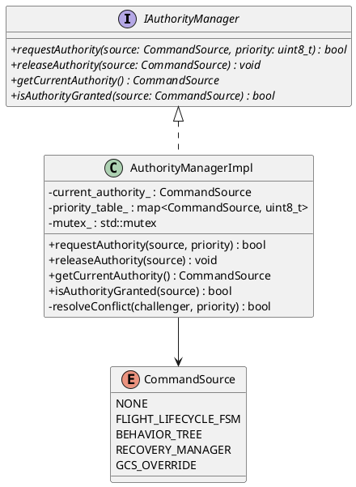
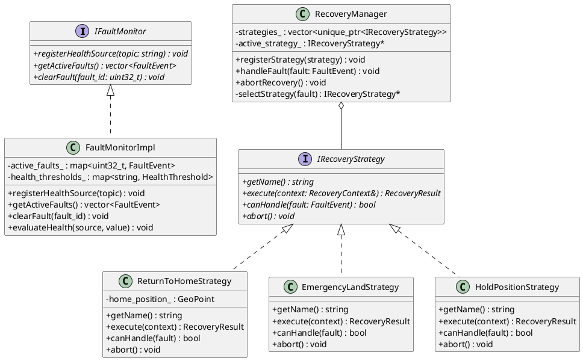
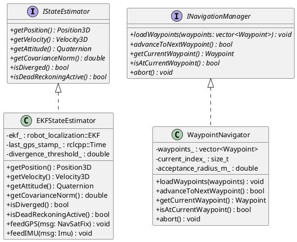
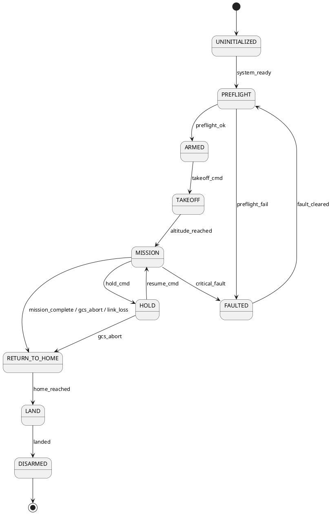
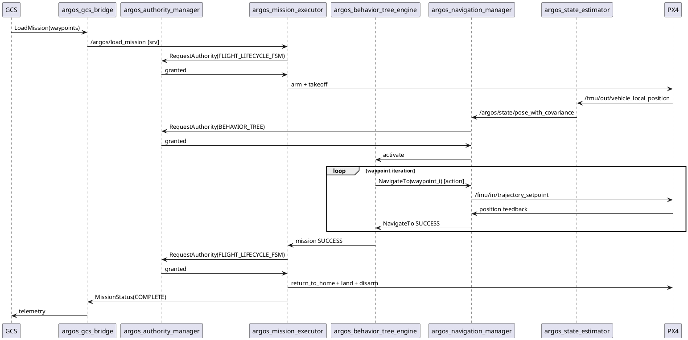
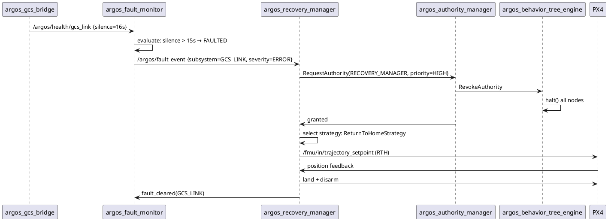
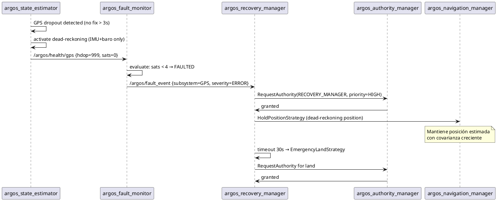
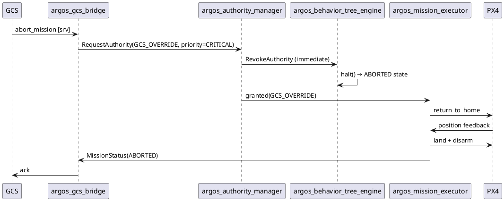

# ARGOS — Especificación de Arquitectura de Producción
### Autonomous Resilient Ground-Operations System

> Documento generado en sesión de arquitectura. Cubre las 9 fases del plan de
> especificación completo, desde la auditoría del diseño original hasta el roadmap
> de implementación hacia TRL-4 SIL.

---

## Índice

1. [Contexto del proyecto](#1-contexto-del-proyecto)
2. [Fase 1 — Auditoría y crítica de la arquitectura original](#fase-1--auditoría-y-crítica-de-la-arquitectura-original)
3. [Fase 2 — Arquitectura mejorada (7 → 11 nodos)](#fase-2--arquitectura-mejorada-7--11-nodos)
4. [Fase 3 — Estructura de paquetes colcon](#fase-3--estructura-de-paquetes-colcon)
5. [Fase 4 — Diagramas de clases (PlantUML)](#fase-4--diagramas-de-clases-plantuml)
6. [Fase 5 — Especificaciones de FSM](#fase-5--especificaciones-de-fsm)
7. [Fase 6 — Diagramas de secuencia](#fase-6--diagramas-de-secuencia)
8. [Fase 7 — Catálogo de interfaces ROS2](#fase-7--catálogo-de-interfaces-ros2)
9. [Fase 8 — Build system y pipeline CI](#fase-8--build-system-y-pipeline-ci)
10. [Fase 9 — Roadmap de implementación](#fase-9--roadmap-de-implementación)
11. [Subpáginas publicadas en Notion](#subpáginas-publicadas-en-notion)

---

## 1. Contexto del proyecto

**ARGOS** (Autonomous Resilient Ground-Operations System) es una capa de software
de ejecución autónoma de misiones que corre en un companion computer (RPi4 / Jetson
Nano) a bordo de un UAV. Se ubica entre el flight controller PX4 y la Ground Control
Station (GCS).

### Posición en el stack

```
┌──────────────────────────────────────┐
│           GCS  (tierra)              │
│   Planificación · Monitoreo · Abort  │
└──────────────────┬───────────────────┘
                   │  enlace cifrado (MAVLink / SROS2)
┌──────────────────▼───────────────────┐
│      ARGOS  (companion computer)     │
│  RPi 4 / Jetson Nano · ROS2 · C++17  │
└──────────────────┬───────────────────┘
                   │  px4-ros2-interface-lib
┌──────────────────▼───────────────────┐
│      PX4  (flight controller)        │
│   Pixhawk / Cube · estabilización    │
└──────────────────────────────────────┘
```

### Stack tecnológico

| Componente | Tecnología |
|------------|------------|
| Middleware | ROS2 Humble / Iron |
| Lenguaje | C++17 |
| Build system | colcon + CMake |
| Árboles de comportamiento | BehaviorTree.CPP v4 |
| Interfaz con PX4 | px4-ros2-interface-lib |
| Estimación de estado | robot_localization (EKF) |
| Seguridad de comunicación | SROS2 (DDS Security) |
| Logging de misión | rosbag2 |
| Simulación | PX4 SITL + Gazebo Harmonic |
| Hardware objetivo | Raspberry Pi 4 / NVIDIA Jetson Nano |
| Flight controller | Pixhawk / Cube (PX4) |

---

## Fase 1 — Auditoría y crítica de la arquitectura original

### Diseño original: 7 nodos + 2 FSMs

| Nodo original | Responsabilidad declarada |
|---------------|--------------------------|
| `argos_state_machine` | FSM de ciclo de vida de vuelo |
| `argos_mission_planner` | Planificación y ejecución de misión |
| `argos_navigation` | Control de waypoints y heading |
| `argos_sensor_fusion` | Fusión GPS/IMU/baro → EKF |
| `argos_fdir` | Fault Detection, Isolation & Recovery |
| `argos_comm_manager` | Enlace GCS (MAVLink/SROS2) |
| `argos_behavior_tree` | Ejecución de BehaviorTree.CPP |

### Hallazgos críticos por nodo

#### `argos_state_machine` y `argos_fdir` — Doble autoridad FSM
- **Problema:** Ambos nodos publican comandos de modo al flight controller. No existe
  árbitro. En escenario de fault-during-mission, ambos FSMs intentan transicionar
  simultáneamente → condición de carrera no determinista.
- **Severidad:** CRÍTICA. Viola SRP y produce comportamiento indefinido en campo.
- **Estándar violado:** MIL-STD-882 (hazard causa por control conflict).

#### `argos_mission_planner` — God object
- **Problema:** Combina planificación de ruta, gestión de waypoints, lógica de
  decisión de misión y publicación de setpoints a PX4. Más de una razón para cambiar.
- **Severidad:** ALTA. Imposible testear unitariamente; acoplamiento máximo con PX4.

#### `argos_behavior_tree` — Desacoplado del lifecycle
- **Problema:** El nodo BT no está vinculado al ROS2 Managed Node lifecycle. Puede
  estar ejecutando un árbol mientras el sistema está en estado PREFLIGHT o FAULTED.
- **Severidad:** ALTA. Comportamiento indefinido al arrancar/apagar el sistema.

#### `argos_sensor_fusion` — EKF silencioso
- **Problema:** No publica métricas de calidad de estimación (covarianza, estado de
  divergencia). Los nodos consumidores no pueden detectar degradación de la estimación.
- **Severidad:** ALTA. Navegación con posición inválida sin saberlo.

#### `argos_fdir` — Mezcla detección y recuperación
- **Problema:** Un único nodo hace detección de fallas Y ejecuta protocolos de
  recuperación. Si el nodo falla durante la recuperación, no hay quien lo detecte.
- **Severidad:** ALTA. Viola SRP; crea punto único de falla en el subsistema de seguridad.

#### Sin watchdog de sistema
- **Problema:** No existe mecanismo de heartbeat entre nodos. Si cualquier nodo crítico
  muere silenciosamente (deadlock, OOM), el sistema continúa operando en estado
  degradado sin saberlo.
- **Severidad:** CRÍTICA. Viola el principio de fail-safe.

#### PX4 offboard keepalive indefinido
- **Problema:** El modo offboard de PX4 requiere setpoints a ≥2 Hz o revierte a Hold.
  Ningún nodo tiene responsabilidad explícita de mantener el keepalive.
- **Severidad:** MEDIA-ALTA. Pérdida de control en mid-mission.

### Resumen de violaciones

| Principio | Nodos afectados |
|-----------|-----------------|
| SRP (Single Responsibility) | state_machine, fdir, mission_planner |
| Fail-safe / Watchdog | todos (ausente) |
| Command arbitration | state_machine + fdir |
| Observability | sensor_fusion |
| Lifecycle coupling | behavior_tree |

**Decisión clave:** La arquitectura original no es segura para operación autónoma
en campo. Los problemas no son de implementación sino de diseño estructural. Se
requiere rediseño con separación de responsabilidades y patrones de resiliencia.

---

## Fase 2 — Arquitectura mejorada (7 → 11 nodos)

### Nuevos nodos añadidos

| Nodo nuevo | Patrón GoF | Justificación |
|------------|------------|---------------|
| `argos_authority_manager` | Mediator | Árbitro único de comandos; elimina doble autoridad FSM |
| `argos_system_watchdog` | Watchdog + Heartbeat | Detecta nodos muertos; dispara failsafe |
| `argos_fault_monitor` | Observer | Solo detección; publica eventos de falla |
| `argos_recovery_manager` | Strategy | Solo recuperación; protocolos intercambiables |
| `argos_health_reporter` | Aggregator | Telemetría de salud al GCS |

### Nodos refactorizados

| Nodo original | Nodo mejorado | Cambio |
|---------------|---------------|--------|
| `argos_mission_planner` | `argos_mission_executor` | Elimina planificación; solo ejecución |
| `argos_sensor_fusion` | `argos_state_estimator` | Publica covarianza y estado EKF |
| `argos_behavior_tree` | `argos_behavior_tree_engine` | Lifecycle-coupled; hilo dedicado |
| `argos_fdir` | eliminado | Dividido en fault_monitor + recovery_manager |

### Arquitectura en capas (DAG)

```
┌─────────────────────────────────────────────────┐
│  COMUNICACIÓN        argos_gcs_bridge            │
├─────────────────────────────────────────────────┤
│  MISIÓN              argos_mission_executor      │
│                      argos_behavior_tree_engine  │
├─────────────────────────────────────────────────┤
│  NAVEGACIÓN          argos_navigation_manager    │
│                      argos_state_estimator       │
├─────────────────────────────────────────────────┤
│  INFRAESTRUCTURA     argos_authority_manager     │ ← árbitro de comandos
│                      argos_system_watchdog       │ ← heartbeat y failsafe
│                      argos_fault_monitor         │ ← detección de fallas
│                      argos_recovery_manager      │ ← ejecución de recuperación
│                      argos_health_reporter       │ ← telemetría de salud
└─────────────────────────────────────────────────┘
```

### Patrones de diseño aplicados

| Patrón | Nodo | Beneficio |
|--------|------|-----------|
| **Mediator** | `argos_authority_manager` | Punto único de arbitraje; elimina acoplamiento directo entre FSM y BT |
| **Watchdog + Heartbeat** | `argos_system_watchdog` | Timeout configurable por nodo; falla → acción de seguridad |
| **Active Object** | `argos_behavior_tree_engine` | BT en hilo dedicado; no bloquea executor ROS2 |
| **Strategy** | `argos_recovery_manager` | Protocolos RTH/land/hold intercambiables en runtime |
| **Observer** | `argos_fault_monitor` | Suscripción a health topics; sin acoplamiento a productores |
| **Adapter** | `argos_navigation_manager` | Abstrae px4-ros2-interface-lib; portabilidad de FC |
| **Dependency Inversion** | todos los core libs | Interfaces abstractas; core sin ROS2 |
| **Null Object** | recovery actions | Acción nula si no hay protocolo aplicable; evita null checks |

### Justificación contra estándares

| Estándar | Decisión arquitectónica justificada |
|----------|-------------------------------------|
| **DO-178C** | Dependency inversion → librerías core testables unitariamente sin ROS2 |
| **MIL-STD-882** | authority_manager elimina condición de carrera identificada como hazard |
| **NASA cFS** | Separación core lib / adapter node replica el patrón cFS App + PSP |
| **AUTOSAR** | Watchdog de sistema con timeout configurable por nodo |
| **ROS2 Managed Lifecycle** | Todos los nodos implementan lifecycle; BT solo ejecuta en ACTIVE |

### Tabla de deferimiento TRL-4

| Feature | Razón de deferimiento |
|---------|-----------------------|
| Sensor redundancy (dual GPS) | Hardware no disponible en SIL |
| Formal verification (SPIN/TLA+) | Post-TRL-4; requiere modelos completos |
| Hardware-in-the-loop (HIL) | Requiere Pixhawk físico |
| SROS2 full policy enforcement | Configuración post-SIL-demo |
| Multi-vehicle coordination | Fuera de scope v1 |

**Decisión clave:** La arquitectura de 11 nodos resuelve los 7 hallazgos críticos
de la Fase 1. El patrón central es el Mediator (`argos_authority_manager`) que
rompe la doble autoridad FSM, y el Watchdog que garantiza fail-safe ante nodos
silenciosos.

---

## Fase 3 — Estructura de paquetes colcon

### Árbol completo del workspace

```
argos-mission-software/
└── src/
    │
    ├── argos_msgs/                    # Interfaces ROS2 (msgs, srvs, actions)
    │   ├── msg/
    │   │   ├── MissionStatus.msg
    │   │   ├── FlightState.msg
    │   │   ├── FaultEvent.msg
    │   │   ├── SystemHealth.msg
    │   │   ├── NodeHeartbeat.msg
    │   │   └── WaypointList.msg
    │   ├── srv/
    │   │   ├── ArmDisarm.srv
    │   │   ├── LoadMission.srv
    │   │   ├── SetRecoveryPolicy.srv
    │   │   └── RequestAuthority.srv
    │   ├── action/
    │   │   ├── ExecuteMission.action
    │   │   └── NavigateTo.action
    │   └── CMakeLists.txt
    │
    ├── argos_core_mission/            # C++ puro — lógica de misión
    │   ├── include/argos_core_mission/
    │   │   ├── IMissionExecutor.hpp
    │   │   └── MissionExecutorImpl.hpp
    │   ├── src/MissionExecutorImpl.cpp
    │   └── CMakeLists.txt
    │
    ├── argos_core_navigation/         # C++ puro — navegación y EKF
    │   ├── include/argos_core_navigation/
    │   │   ├── IStateEstimator.hpp
    │   │   ├── INavigationManager.hpp
    │   │   ├── EKFStateEstimator.hpp
    │   │   └── WaypointNavigator.hpp
    │   ├── src/
    │   │   ├── EKFStateEstimator.cpp
    │   │   └── WaypointNavigator.cpp
    │   └── CMakeLists.txt
    │
    ├── argos_core_fdir/               # C++ puro — detección y recuperación
    │   ├── include/argos_core_fdir/
    │   │   ├── IFaultMonitor.hpp
    │   │   ├── IRecoveryStrategy.hpp
    │   │   ├── FaultMonitorImpl.hpp
    │   │   ├── ReturnToHomeStrategy.hpp
    │   │   ├── EmergencyLandStrategy.hpp
    │   │   └── HoldPositionStrategy.hpp
    │   ├── src/
    │   │   ├── FaultMonitorImpl.cpp
    │   │   ├── ReturnToHomeStrategy.cpp
    │   │   ├── EmergencyLandStrategy.cpp
    │   │   └── HoldPositionStrategy.cpp
    │   └── CMakeLists.txt
    │
    ├── argos_core_authority/          # C++ puro — arbitraje de autoridad
    │   ├── include/argos_core_authority/
    │   │   ├── IAuthorityManager.hpp
    │   │   └── AuthorityManagerImpl.hpp
    │   ├── src/AuthorityManagerImpl.cpp
    │   └── CMakeLists.txt
    │
    ├── argos_mission_executor_node/   # Nodo ROS2 — adaptador de misión
    │   ├── src/MissionExecutorNode.cpp
    │   └── CMakeLists.txt
    │
    ├── argos_behavior_tree_engine_node/
    │   ├── src/BehaviorTreeEngineNode.cpp
    │   ├── trees/
    │   │   ├── nominal_mission.xml
    │   │   └── recovery_mission.xml
    │   └── CMakeLists.txt
    │
    ├── argos_navigation_manager_node/
    │   ├── src/NavigationManagerNode.cpp
    │   └── CMakeLists.txt
    │
    ├── argos_state_estimator_node/
    │   ├── src/StateEstimatorNode.cpp
    │   └── CMakeLists.txt
    │
    ├── argos_authority_manager_node/
    │   ├── src/AuthorityManagerNode.cpp
    │   └── CMakeLists.txt
    │
    ├── argos_system_watchdog_node/
    │   ├── src/SystemWatchdogNode.cpp
    │   └── CMakeLists.txt
    │
    ├── argos_fault_monitor_node/
    │   ├── src/FaultMonitorNode.cpp
    │   └── CMakeLists.txt
    │
    ├── argos_recovery_manager_node/
    │   ├── src/RecoveryManagerNode.cpp
    │   └── CMakeLists.txt
    │
    ├── argos_health_reporter_node/
    │   ├── src/HealthReporterNode.cpp
    │   └── CMakeLists.txt
    │
    ├── argos_gcs_bridge_node/
    │   ├── src/GcsBridgeNode.cpp
    │   └── CMakeLists.txt
    │
    ├── argos_bringup/                 # Launch files y configuración
    │   ├── launch/
    │   │   ├── argos_full.launch.py
    │   │   ├── argos_sitl.launch.py
    │   │   └── argos_hardware.launch.py
    │   ├── config/
    │   │   ├── ekf_params.yaml
    │   │   ├── watchdog_timeouts.yaml
    │   │   └── recovery_policies.yaml
    │   └── CMakeLists.txt
    │
    └── argos_simulation/              # Mundos Gazebo y helpers SITL
        ├── worlds/
        │   └── argos_test_field.world
        ├── models/
        └── CMakeLists.txt
```

### Tabla de rationale por paquete

| Paquete | Capa | Dependencia ROS2 | Testeable sin ROS2 | Razón |
|---------|------|------------------|--------------------|-------|
| `argos_msgs` | Interface | Sí (rosidl) | N/A | Contrato de datos entre nodos |
| `argos_core_*` | Core | No | ✅ Sí | Lógica pura; GTest unitario directo |
| `argos_*_node` | Adapter | Sí | ❌ No | Thin wrapper; solo ROS2 I/O |
| `argos_bringup` | Integration | Sí (launch) | N/A | Composición del sistema |
| `argos_simulation` | Simulation | Opcional | N/A | Solo para SITL |

**Decisión clave:** La separación `argos_core_*` (C++ puro) / `argos_*_node`
(adapter ROS2) es la decisión arquitectónica más importante del workspace. Permite
testear el 80% de la lógica de negocio con GTest puro, sin levantar un nodo ROS2.

---

## Fase 4 — Diagramas de clases (PlantUML)

### `argos_core_authority`



### `argos_core_fdir`



### `argos_core_navigation`



### Tabla de asignación de executors y thread-safety

| Nodo | Executor | Threads | Acceso compartido | Mecanismo de sincronización |
|------|----------|---------|-------------------|-----------------------------|
| `argos_authority_manager_node` | SingleThreaded | 1 | `current_authority_` | `std::mutex` en `AuthorityManagerImpl` |
| `argos_behavior_tree_engine_node` | MultiThreaded | 2 | BT blackboard | `BT::Blackboard` thread-safe por diseño |
| `argos_system_watchdog_node` | SingleThreaded | 1 | heartbeat timestamps | `std::atomic<rclcpp::Time>` |
| `argos_fault_monitor_node` | SingleThreaded | 1 | `active_faults_` | `std::mutex` |
| `argos_recovery_manager_node` | SingleThreaded | 1 | `active_strategy_` | `std::mutex` |
| `argos_state_estimator_node` | MultiThreaded | 2 | EKF state | `std::mutex` en `EKFStateEstimator` |

**Decisión clave:** La separación de interfaces abstractas (`IAuthorityManager`,
`IFaultMonitor`, `IRecoveryStrategy`, `IStateEstimator`, `INavigationManager`)
de sus implementaciones permite sustituir implementaciones en tests con mocks sin
modificar el código de producción (Dependency Inversion Principle).

---

## Fase 5 — Especificaciones de FSM

### FSM 1: Flight Lifecycle

#### Estados

| Estado | Significado |
|--------|-------------|
| `UNINITIALIZED` | Sistema iniciando; lifecycle nodes no activos |
| `PREFLIGHT` | Checks pre-vuelo en curso (GPS fix, EKF convergido, batería OK) |
| `ARMED` | Vehículo armado; esperando comando de despegue |
| `TAKEOFF` | Despegue en progreso hacia altitud de misión |
| `MISSION` | Ejecución de árbol de comportamiento activa |
| `HOLD` | Vehículo en hover; misión pausada |
| `RETURN_TO_HOME` | Protocolo RTH activo |
| `LAND` | Aterrizaje en progreso |
| `DISARMED` | Motor desarmado; misión completa o abortada |
| `FAULTED` | Falla crítica; esperando intervención |

#### Tabla de transiciones

| Estado origen | Evento | Condición | Estado destino |
|---------------|--------|-----------|----------------|
| `UNINITIALIZED` | `system_ready` | Todos los lifecycle nodes en ACTIVE | `PREFLIGHT` |
| `PREFLIGHT` | `preflight_ok` | GPS fix ≥ 6 sats, EKF converged, batt ≥ 20% | `ARMED` |
| `PREFLIGHT` | `preflight_fail` | Cualquier check falla | `FAULTED` |
| `ARMED` | `takeoff_cmd` | authority_manager grants BT | `TAKEOFF` |
| `TAKEOFF` | `altitude_reached` | \|alt - target\| < 0.5m | `MISSION` |
| `MISSION` | `mission_complete` | BT retorna SUCCESS | `RETURN_TO_HOME` |
| `MISSION` | `gcs_abort` | GCS envía abort | `RETURN_TO_HOME` |
| `MISSION` | `critical_fault` | fault_monitor publica severity=CRITICAL | `FAULTED` |
| `MISSION` | `link_loss` | GCS link perdido > timeout | `RETURN_TO_HOME` |
| `HOLD` | `resume_cmd` | authority_manager grants BT | `MISSION` |
| `HOLD` | `gcs_abort` | — | `RETURN_TO_HOME` |
| `RETURN_TO_HOME` | `home_reached` | dist_to_home < 2m | `LAND` |
| `LAND` | `landed` | velocity < 0.1 m/s AND rangefinder < 0.3m | `DISARMED` |
| `FAULTED` | `fault_cleared` | recovery_manager resuelve falla | `PREFLIGHT` |

#### Diagrama PlantUML



#### Invariantes

1. Solo `argos_authority_manager` puede aprobar transiciones que generan comandos a PX4.
2. El BT solo ejecuta cuando el lifecycle FSM está en estado `MISSION`.
3. Toda transición a `FAULTED` genera un log estructurado con timestamp, nodo origen y severidad.
4. `RETURN_TO_HOME` siempre pasa por `LAND` antes de `DISARMED` (nunca directo).

---

### FSM 2: FDIR Health (por subsistema)

#### Estados

| Estado | Significado |
|--------|-------------|
| `HEALTHY` | Métricas dentro de umbrales nominales |
| `DEGRADED` | Métrica fuera de umbral WARNING; misión puede continuar |
| `FAULTED` | Métrica fuera de umbral ERROR; requiere recuperación |
| `RECOVERING` | Protocolo de recuperación activo |
| `FAILED` | Recuperación fallida; falla permanente |

#### Tabla de transiciones

| Origen | Evento | Destino |
|--------|--------|---------|
| `HEALTHY` | métrica > WARNING_threshold | `DEGRADED` |
| `DEGRADED` | métrica > ERROR_threshold | `FAULTED` |
| `DEGRADED` | métrica vuelve < WARNING_threshold | `HEALTHY` |
| `FAULTED` | recovery_manager inicia protocolo | `RECOVERING` |
| `RECOVERING` | protocolo exitoso | `HEALTHY` |
| `RECOVERING` | protocolo falla o timeout | `FAILED` |
| `FAILED` | — | permanente (requiere reinicio) |

#### Subsistemas monitoreados

| Subsistema | Métrica | WARNING | ERROR |
|------------|---------|---------|-------|
| GPS | sats_in_view | < 8 | < 4 |
| GPS | hdop | > 2.0 | > 5.0 |
| EKF | covariance_norm | > 1.0 | > 5.0 |
| Batería | voltage_pct | < 30% | < 15% |
| GCS link | silence_sec | > 5s | > 15s |
| IMU | accel_variance | > 0.5 | > 2.0 |

---

### FSM 3: BT Executor

#### Estados

| Estado | Significado |
|--------|-------------|
| `IDLE` | Sin árbol cargado o en espera |
| `LOADING` | Árbol XML siendo parseado y validado |
| `READY` | Árbol cargado; esperando autoridad |
| `RUNNING` | tick() activo en hilo dedicado |
| `PAUSED` | tick() suspendido; árbol en memoria |
| `SUCCEEDED` | Árbol retornó SUCCESS |
| `FAILED` | Árbol retornó FAILURE |
| `ABORTED` | Abort externo; árbol interrumpido |

#### Invariantes del BT Executor

1. `tick()` solo se llama cuando el Flight Lifecycle FSM está en `MISSION`.
2. El BT Executor corre en un `std::thread` dedicado, no en el executor de ROS2.
3. El blackboard es el único canal de comunicación entre nodos BT y el resto del sistema.
4. Ante `ABORTED`, todos los nodos BT ejecutan su método `halt()` antes de destruir el árbol.

**Decisión clave:** Las tres FSMs son ortogonales pero coordinadas por
`argos_authority_manager`. El Flight Lifecycle FSM tiene precedencia sobre el BT
Executor; el FDIR Health FSM puede interrumpir ambos mediante eventos de falla.

---

## Fase 6 — Diagramas de secuencia

### Escenario 1: Misión nominal



### Escenario 2: Pérdida de enlace GCS



### Escenario 3: Falla GPS / Dead-reckoning



### Escenario 4: Abort desde GCS



**Decisión clave:** En todos los escenarios de falla, el flujo pasa por
`argos_authority_manager`. Esto garantiza que en ningún caso dos fuentes de
comandos compiten directamente por el control del vehículo.

---

## Fase 7 — Catálogo de interfaces ROS2

### Topics publicados por nodo

| Topic | Tipo | Publisher | QoS | Rate | Descripción |
|-------|------|-----------|-----|------|-------------|
| `/argos/state/pose_with_covariance` | `geometry_msgs/PoseWithCovarianceStamped` | state_estimator | RELIABLE, TRANSIENT_LOCAL | 50 Hz | Posición + covarianza EKF |
| `/argos/state/velocity` | `geometry_msgs/TwistStamped` | state_estimator | BEST_EFFORT | 50 Hz | Velocidad estimada |
| `/argos/state/ekf_status` | `argos_msgs/EKFStatus` | state_estimator | RELIABLE | 10 Hz | Estado EKF: converged, dead_reckoning, covariance_norm |
| `/argos/mission/status` | `argos_msgs/MissionStatus` | mission_executor | RELIABLE, TRANSIENT_LOCAL | 5 Hz | Estado de misión actual |
| `/argos/flight/state` | `argos_msgs/FlightState` | mission_executor | RELIABLE, TRANSIENT_LOCAL | 10 Hz | Estado FSM de vuelo |
| `/argos/fault/events` | `argos_msgs/FaultEvent` | fault_monitor | RELIABLE | event-driven | Eventos de falla con severidad |
| `/argos/health/system` | `argos_msgs/SystemHealth` | health_reporter | RELIABLE | 1 Hz | Salud agregada de todos los subsistemas |
| `/argos/watchdog/heartbeat` | `argos_msgs/NodeHeartbeat` | cada nodo crítico | BEST_EFFORT | 10 Hz | Heartbeat por nodo |
| `/argos/authority/current` | `std_msgs/String` | authority_manager | RELIABLE, TRANSIENT_LOCAL | event-driven | Fuente de autoridad actual |

### Servicios

| Servicio | Tipo | Server | Descripción |
|----------|------|--------|-------------|
| `/argos/mission/load` | `argos_msgs/LoadMission` | mission_executor | Carga lista de waypoints |
| `/argos/mission/abort` | `std_srvs/Trigger` | mission_executor | Aborta misión en curso |
| `/argos/arm` | `argos_msgs/ArmDisarm` | mission_executor | Arma/desarma vehículo |
| `/argos/recovery/set_policy` | `argos_msgs/SetRecoveryPolicy` | recovery_manager | Configura política de recuperación |
| `/argos/authority/request` | `argos_msgs/RequestAuthority` | authority_manager | Solicita autoridad de comando |

### Actions

| Action | Tipo | Server | Descripción |
|--------|------|--------|-------------|
| `/argos/mission/execute` | `argos_msgs/ExecuteMission` | behavior_tree_engine | Ejecuta árbol de misión completo |
| `/argos/navigate_to` | `argos_msgs/NavigateTo` | navigation_manager | Navega a waypoint específico |

### Definiciones de mensajes custom

```
# argos_msgs/msg/MissionStatus.msg
uint8 IDLE = 0
uint8 LOADING = 1
uint8 RUNNING = 2
uint8 PAUSED = 3
uint8 COMPLETE = 4
uint8 ABORTED = 5
uint8 FAILED = 6

std_msgs/Header header
uint8 status
uint32 current_waypoint_index
uint32 total_waypoints
float32 mission_progress_pct    # [0.0, 100.0]
float64 distance_to_next_wp_m
string active_bt_node
```

```
# argos_msgs/msg/FaultEvent.msg
uint8 SEVERITY_WARNING = 1
uint8 SEVERITY_ERROR = 2
uint8 SEVERITY_CRITICAL = 3

uint8 SUBSYSTEM_GPS = 1
uint8 SUBSYSTEM_IMU = 2
uint8 SUBSYSTEM_BATTERY = 3
uint8 SUBSYSTEM_GCS_LINK = 4
uint8 SUBSYSTEM_EKF = 5
uint8 SUBSYSTEM_NAVIGATION = 6

std_msgs/Header header
uint32 fault_id
uint8 subsystem
uint8 severity
string description
float64 metric_value
float64 threshold_value
```

```
# argos_msgs/msg/SystemHealth.msg
std_msgs/Header header
uint8 HEALTH_OK = 0
uint8 HEALTH_DEGRADED = 1
uint8 HEALTH_FAULTED = 2

uint8 overall_health
uint8 gps_health
uint8 imu_health
uint8 battery_health
uint8 gcs_link_health
uint8 ekf_health
float32 battery_voltage
float32 battery_pct          # [0.0, 100.0]
uint8 gps_satellites
float32 gps_hdop
float32 ekf_covariance_norm
bool ekf_dead_reckoning_active
```

```
# argos_msgs/srv/LoadMission.srv
geometry_msgs/PoseStamped[] waypoints
float32 acceptance_radius_m   # default: 1.0
float32 cruise_speed_mps      # default: 5.0
---
bool success
string message
uint32 waypoints_loaded
```

```
# argos_msgs/action/ExecuteMission.action
# Goal
string mission_id
bool return_to_home_on_complete
---
# Result
bool success
string final_status
uint32 waypoints_completed
float64 total_distance_m
float64 mission_duration_sec
---
# Feedback
argos_msgs/MissionStatus current_status
float64 elapsed_sec
```

**Decisión clave:** QoS `TRANSIENT_LOCAL` en topics de estado garantiza que nodos
que se reinicien reciben el último estado sin esperar el próximo publish. QoS
`BEST_EFFORT` en heartbeats evita que la red de heartbeat sature el middleware.

---

## Fase 8 — Build system y pipeline CI

### Reference `CMakeLists.txt` (patrón lib/exec separation)

```cmake
# argos_core_fdir/CMakeLists.txt
cmake_minimum_required(VERSION 3.16)
project(argos_core_fdir VERSION 1.0.0 LANGUAGES CXX)

set(CMAKE_CXX_STANDARD 17)
set(CMAKE_CXX_STANDARD_REQUIRED ON)

# ── Core library (NO ROS2 dependency) ─────────────────────────────────────────
add_library(argos_core_fdir_lib SHARED
  src/FaultMonitorImpl.cpp
  src/ReturnToHomeStrategy.cpp
  src/EmergencyLandStrategy.cpp
  src/HoldPositionStrategy.cpp
)

target_include_directories(argos_core_fdir_lib
  PUBLIC
    $<BUILD_INTERFACE:${CMAKE_CURRENT_SOURCE_DIR}/include>
    $<INSTALL_INTERFACE:include>
)

target_compile_options(argos_core_fdir_lib PRIVATE
  -Wall -Wextra -Wpedantic -Werror
)

# ── Unit tests (GTest, no ROS2) ────────────────────────────────────────────────
if(BUILD_TESTING)
  find_package(GTest REQUIRED)
  enable_testing()

  add_executable(test_fault_monitor
    test/test_fault_monitor.cpp
  )
  target_link_libraries(test_fault_monitor
    argos_core_fdir_lib
    GTest::gtest_main
  )

  add_executable(test_recovery_strategies
    test/test_recovery_strategies.cpp
  )
  target_link_libraries(test_recovery_strategies
    argos_core_fdir_lib
    GTest::gtest_main
  )

  include(GoogleTest)
  gtest_discover_tests(test_fault_monitor)
  gtest_discover_tests(test_recovery_strategies)
endif()

# ── Install ────────────────────────────────────────────────────────────────────
install(TARGETS argos_core_fdir_lib
  EXPORT argos_core_fdir_libTargets
  LIBRARY DESTINATION lib
  ARCHIVE DESTINATION lib
  RUNTIME DESTINATION bin
)

install(DIRECTORY include/
  DESTINATION include
)

install(EXPORT argos_core_fdir_libTargets
  FILE argos_core_fdir_libTargets.cmake
  NAMESPACE argos::
  DESTINATION lib/cmake/argos_core_fdir_lib
)
```

### GitHub Actions CI Pipeline

```yaml
# .github/workflows/ci.yaml
name: ARGOS CI

on:
  push:
    branches: [main, develop, 'feature/**', 'claude/**']
  pull_request:
    branches: [main, develop]

env:
  ROS_DISTRO: humble

jobs:
  # ── Job 1: Build + Unit Tests (no ROS2) ────────────────────────────────────
  build-and-test-core:
    name: Core libs build + GTest
    runs-on: ubuntu-22.04
    steps:
      - uses: actions/checkout@v4

      - name: Install dependencies
        run: |
          sudo apt-get update
          sudo apt-get install -y cmake build-essential libgtest-dev

      - name: Build core libs
        run: |
          cmake -B build/core \
            -DCMAKE_BUILD_TYPE=RelWithDebInfo \
            -DBUILD_TESTING=ON
          cmake --build build/core --parallel $(nproc)

      - name: Run unit tests
        run: |
          cd build/core
          ctest --output-on-failure --parallel $(nproc)

      - name: Coverage report
        run: |
          cmake -B build/coverage \
            -DCMAKE_BUILD_TYPE=Debug \
            -DBUILD_TESTING=ON \
            -DCMAKE_CXX_FLAGS="--coverage"
          cmake --build build/coverage --parallel $(nproc)
          cd build/coverage && ctest
          gcovr --root ../.. --filter '.*argos_core.*' \
            --fail-under-line 80 \
            --xml coverage.xml

      - name: Upload coverage
        uses: codecov/codecov-action@v4
        with:
          files: build/coverage/coverage.xml

  # ── Job 2: ROS2 colcon build + lint ────────────────────────────────────────
  colcon-build:
    name: colcon build (${{ matrix.ros_distro }})
    runs-on: ubuntu-22.04
    strategy:
      matrix:
        ros_distro: [humble, iron]
    container:
      image: ros:${{ matrix.ros_distro }}-ros-base

    steps:
      - uses: actions/checkout@v4
        with:
          path: src/argos-mission-software

      - name: Install rosdep dependencies
        run: |
          rosdep update
          rosdep install --from-paths src --ignore-src -r -y

      - name: colcon build
        run: |
          source /opt/ros/${{ matrix.ros_distro }}/setup.bash
          colcon build \
            --symlink-install \
            --cmake-args -DCMAKE_BUILD_TYPE=RelWithDebInfo \
            --event-handlers console_cohesion+

      - name: colcon test
        run: |
          source /opt/ros/${{ matrix.ros_distro }}/setup.bash
          colcon test --event-handlers console_cohesion+
          colcon test-result --verbose

  # ── Job 3: ament_lint ──────────────────────────────────────────────────────
  lint:
    name: ament_lint
    runs-on: ubuntu-22.04
    container:
      image: ros:humble-ros-base
    steps:
      - uses: actions/checkout@v4
        with:
          path: src/argos-mission-software

      - name: Install lint tools
        run: |
          apt-get install -y \
            ros-humble-ament-lint-auto \
            ros-humble-ament-cpplint \
            ros-humble-ament-cppcheck \
            ros-humble-ament-clang-format

      - name: Run ament_lint
        run: |
          source /opt/ros/humble/setup.bash
          ament_cpplint src/argos-mission-software/src
          ament_cppcheck src/argos-mission-software/src
          ament_clang_format --reformat src/argos-mission-software/src

  # ── Job 4: SIL smoke test ──────────────────────────────────────────────────
  sil-smoke:
    name: SIL smoke test (PX4 SITL)
    runs-on: ubuntu-22.04
    needs: [build-and-test-core, colcon-build]
    if: github.ref == 'refs/heads/main' || github.ref == 'refs/heads/develop'

    steps:
      - uses: actions/checkout@v4

      - name: Start PX4 SITL + Gazebo Harmonic
        run: |
          docker-compose -f simulation/docker-compose.sitl.yaml up -d
          sleep 30  # wait for SITL init

      - name: Run smoke mission
        run: |
          source /opt/ros/humble/setup.bash
          ros2 launch argos_bringup argos_sitl.launch.py &
          sleep 10
          ros2 service call /argos/mission/load argos_msgs/srv/LoadMission \
            "{waypoints: [{pose: {position: {x: 10.0, y: 0.0, z: -10.0}}}]}"
          timeout 120 ros2 topic echo /argos/mission/status --once \
            | grep -q "status: 4"  # COMPLETE

      - name: Cleanup
        if: always()
        run: docker-compose -f simulation/docker-compose.sitl.yaml down
```

**Decisión clave:** El pipeline tiene 4 jobs independientes. Los jobs 1 y 2 pueden
correr en paralelo. El job 4 (SIL) solo se ejecuta en `main`/`develop` para no
saturar los runners, y tiene un coverage gate de 80% como prerequisito.

---

## Fase 9 — Roadmap de implementación

### Overview de fases

| Fase | Nombre | Complejidad | Prerequisitos |
|------|--------|-------------|---------------|
| **9.1** | Core Infrastructure | M | — |
| **9.2** | Authority & Lifecycle | M | 9.1 |
| **9.3** | Navigation | L | 9.1 |
| **9.4** | Fault Management | L | 9.1, 9.2 |
| **9.5** | Mission Execution | L | 9.2, 9.3 |
| **9.6** | GCS Bridge | M | 9.2 |
| **9.7** | PX4 Integration | XL | 9.3, 9.5 |
| **9.8** | SIL Demonstrator | XL | 9.4, 9.6, 9.7 |
| **9.9** | Hardening | M | 9.8 |

*S = días, M = 1-2 semanas, L = 2-4 semanas, XL = 4-8 semanas*

---

### Fase 9.1 — Core Infrastructure

**Deliverables:**
- Paquete `argos_msgs` con todos los mensajes, servicios y actions definidos en Fase 7
- Paquetes `argos_core_authority`, `argos_core_fdir`, `argos_core_navigation`, `argos_core_mission`
- Interfaces abstractas implementadas (headers completos)
- Paquete `argos_system_watchdog_node` funcional con heartbeat loop

**Definition of Done:**
- [ ] `colcon build` verde en Humble e Iron
- [ ] `argos_msgs` genera bindings C++ y Python correctamente
- [ ] `argos_system_watchdog_node` detecta nodo muerto en < 2× timeout configurado
- [ ] GTest unitarios para todas las interfaces core (cobertura ≥ 80%)
- [ ] ament_lint verde

---

### Fase 9.2 — Authority & Lifecycle

**Deliverables:**
- `argos_authority_manager_node` implementado con `AuthorityManagerImpl`
- `argos_mission_executor_node` con Flight Lifecycle FSM completa (10 estados)
- Integración authority_manager ↔ mission_executor verificada

**Definition of Done:**
- [ ] Flight Lifecycle FSM transiciona correctamente en todos los escenarios de la Fase 5
- [ ] `argos_authority_manager` resuelve conflictos de prioridad determinísticamente
- [ ] Test de integración: dos fuentes compiten por autoridad → la de mayor prioridad gana
- [ ] Timeout de watchdog dispara `FAULTED` si mission_executor no envía heartbeat

---

### Fase 9.3 — Navigation

**Deliverables:**
- `argos_state_estimator_node` con EKF (robot_localization) + dead-reckoning
- `argos_navigation_manager_node` con WaypointNavigator
- Publicación de covarianza y `ekf_status`

**Definition of Done:**
- [ ] EKF converge con GPS + IMU simulados en < 10s
- [ ] `isDiverged()` retorna `true` cuando covarianza > threshold configurado
- [ ] Dead-reckoning activo y publicado cuando GPS dropout > 3s
- [ ] WaypointNavigator avanza al siguiente waypoint cuando `dist < acceptance_radius`
- [ ] Test unitario de WaypointNavigator sin ROS2

---

### Fase 9.4 — Fault Management

**Deliverables:**
- `argos_fault_monitor_node` suscrito a todos los health topics
- `argos_recovery_manager_node` con las tres estrategias (RTH, EmergencyLand, Hold)
- `argos_health_reporter_node` agregando y publicando `SystemHealth`

**Definition of Done:**
- [ ] FaultMonitor detecta GPS dropout en < 1s
- [ ] FaultMonitor detecta batería crítica en < 1s
- [ ] RecoveryManager selecciona estrategia correcta por tipo de falla
- [ ] EmergencyLandStrategy tiene mayor prioridad que RTH para batería crítica
- [ ] Test de integración: GPS dropout → FaultEvent → RecoveryManager → HoldPositionStrategy

---

### Fase 9.5 — Mission Execution

**Deliverables:**
- `argos_behavior_tree_engine_node` con hilo dedicado y lifecycle coupling
- Árbol BT nominal (`nominal_mission.xml`): Takeoff → Waypoints → RTH
- Árbol BT de recuperación (`recovery_mission.xml`)
- Integración BT ↔ authority_manager

**Definition of Done:**
- [ ] BT solo ejecuta cuando Flight Lifecycle FSM está en MISSION
- [ ] BT ejecuta en hilo separado; no bloquea executor ROS2
- [ ] `halt()` llamado en todos los nodos BT al recibir abort
- [ ] Árbol nominal completa 3-waypoint mission en simulación básica (sin PX4)
- [ ] BT retorna FAILURE ante timeout de NavigateTo action

---

### Fase 9.6 — GCS Bridge

**Deliverables:**
- `argos_gcs_bridge_node` con SROS2 habilitado
- Telemetría de misión y salud al GCS vía `/argos/health/system`
- Recepción de `LoadMission` y `abort_mission` desde GCS
- Detección de link loss con timeout configurable

**Definition of Done:**
- [ ] Link loss detectado en `timeout + 1s` de silencio del GCS
- [ ] FaultEvent publicado con subsystem=GCS_LINK, severity=ERROR en link loss
- [ ] SROS2 certificates generados y validados
- [ ] GCS puede cargar misión y recibir telemetría en < 100ms latencia (loopback)

---

### Fase 9.7 — PX4 Integration

**Deliverables:**
- Integración completa con PX4 SITL via `px4-ros2-interface-lib`
- Takeoff, waypoint navigation y land funcionando en Gazebo Harmonic
- Offboard keepalive implementado en `argos_navigation_manager`
- Telemetría PX4 → EKF operacional

**Definition of Done:**
- [ ] Vehículo arma, despega a 10m y aterriza en SITL sin errores
- [ ] Offboard mode mantenido (setpoints a ≥ 2 Hz) durante toda la misión
- [ ] EKF converge con datos de posición de PX4 SITL
- [ ] GPS dropout en SITL → dead-reckoning activo → FaultEvent publicado

---

### Fase 9.8 — SIL Demonstrator (TRL 4)

**Deliverables:**
- Misión autónoma completa en PX4 SITL + Gazebo Harmonic:
  - Despegue → 3 waypoints → RTH → aterrizaje
- Tolerancia a 3 escenarios de falla:
  - GPS dropout mid-mission → dead-reckoning → RTH al recuperar
  - GCS link loss → RTH autónomo
  - Batería crítica → EmergencyLand
- Logs de misión en rosbag2
- Launch file `argos_sitl.launch.py` funcional

**Definition of Done:**
- [ ] Misión nominal completa en SITL en 3 de 3 ejecuciones consecutivas
- [ ] GPS dropout scenario: vehículo mantiene posición 30s, RTH al recuperar GPS
- [ ] Link loss scenario: RTH autónomo en < 20s de detectar pérdida
- [ ] Battery critical scenario: EmergencyLand en posición actual
- [ ] rosbag2 recording contiene todos los topics definidos en Fase 7
- [ ] CI job 4 (SIL smoke test) verde en GitHub Actions

---

### Fase 9.9 — Hardening

**Deliverables:**
- Cobertura de tests ≥ 80% en todos los paquetes `argos_core_*`
- ament_cpplint + ament_cppcheck + ament_clang_format verde
- Análisis estático con cppcheck sin warnings
- CI pipeline completo verde (jobs 1-4)
- Documentación de API (Doxygen) para todas las interfaces públicas

**Definition of Done:**
- [ ] `gcovr` reporta ≥ 80% line coverage en argos_core_*
- [ ] cppcheck --enable=all sin errores ni warnings
- [ ] clang-format aplicado a todo el código fuente
- [ ] Todos los headers públicos tienen Doxygen `@brief` + `@param` + `@return`
- [ ] CI verde en Humble e Iron en 3 pushes consecutivos
- [ ] README actualizado con instrucciones de build y ejecución SITL

---

### Grafo de dependencias entre fases

```
9.1 ──┬──────────────────────────────┐
      │                              │
      ▼                              ▼
     9.2 ──────┬──────────          9.3
      │        │        │            │
      ▼        ▼        ▼            ▼
     9.4      9.5      9.6          9.5
      │        │        │            │
      └────────┴────────┴────────────┘
                        │
                        ▼
                       9.7
                        │
                        ▼
                       9.8
                        │
                        ▼
                       9.9 ← TRL 4 SIL
```

**Decisión clave:** El camino crítico es 9.1 → 9.2 → 9.5 → 9.7 → 9.8. Las fases
9.3, 9.4 y 9.6 pueden desarrollarse en paralelo una vez completada 9.1/9.2. Esto
permite reducir el tiempo total del proyecto en ~40% con trabajo paralelo.

---

## Subpáginas publicadas en Notion

Todas las fases fueron documentadas como subpáginas bajo la página principal ARGOS
en Notion. Las URLs de cada subpágina son:

| Fase | Título | URL |
|------|--------|-----|
| Phase 1 | Architecture Audit & Critique | https://www.notion.so/36eed5c48bb1819ba629c2bbc67b4f55 |
| Phase 2 | Improved Architecture (7→11 Nodes) | https://www.notion.so/36eed5c48bb181258505e08c3f1827f7 |
| Phase 3 | Package Structure | https://www.notion.so/36eed5c48bb181cca3d7d08858f92210 |
| Phase 4 | Class Diagrams (PlantUML) | https://www.notion.so/36eed5c48bb181e99fe2e54cd64f57fb |
| Phase 5 | FSM Specifications | https://www.notion.so/36eed5c48bb18162a59df784484b1bd8 |
| Phase 6 | Sequence Diagrams | https://www.notion.so/36eed5c48bb181b88b2feda147450466 |
| Phase 7 | ROS2 Interface Catalog | https://www.notion.so/36eed5c48bb181298353f35ecb541b8c |
| Phase 8 | Build System & CI Pipeline | https://www.notion.so/36eed5c48bb181fa9cdac37e6cbe998a |
| Phase 9 | Implementation Roadmap | https://www.notion.so/36eed5c48bb18190b9c2f45cfcbbbd70 |

---

*ARGOS — Autonomous Resilient Ground-Operations System*  
*Santiago Flores — Universidad Blas Pascal, Córdoba, Argentina*
